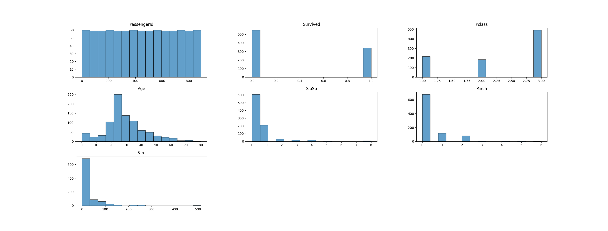

# PROJECT OVERVIEW

This is a **Logistic Regression** project, based on **Titanic dataset** (from **Kaggle**), which is made to predict whether a passenger **survived** the sink or not. Using different features (PassengerId, Pclass, Name, Sex, Age, SibSp, Parch, Ticket, Fare, Cabin) we are trying to predict, actually, to classify a passenger into one of two instances, survived or not survived which are labeled 1 and 0 in the target feature Survived.
After performing dataset visualization, preprocessing and encoding we decided to use the mentioned **Logistic Regression** which we tuned, tested, using a **GridSearchCV**.
Important thing to mention is that we have a **test set** also which we will use for the final prediction which will then be submitted into Kaggle for performance review.


## INSTALLATION

To run this project, follow these steps:

1. **Clone the repository** (if using Git):
git clone https://github.com/RabronixCode/Machine-Learning-Portfolio.git
cd Machine-Learning-Portfolio/Logistic_Regression/Titanic

2. **Install dependencies** from the `requirements.txt` file:
pip install -r requirements.txt

**Python Version:** Ensure you have Python **3.8+** installed.

Now you are ready to run the project!

## DATA DESCRIPTION

The dataset uses passenger records from the Titanic accident which we found on Kaggle. It consists of **two** datasets:
    - **Train set** - **891 rows** and **11 columns** used for model training. Ten features are predictors and 1 feature is a target variable named `Survived` representing a value 0 or 1 depending on if the person survived or not.
    - **Test set** - **418 rows** and **10 columns** used for final predictions. The test set is without the `Survived` column because we need to predict that.

Every preprocessing step that is done on the **train set** needs to be done on the **test set** too.

### Dataset Features

| Feature           | Type        | Description |
|-------------------|-------------|-------------|
| `PassengerId`     | Integer     | Id of the passenger |
| `Pclass`          | Integer     | Passenger class, values are: 1 = 1st, 2 = 2nd or 3 = 3rd |
| `Name`            | Categorical | Name of the passenger |
| `Sex`             | Categorical | Sex of the passenger, values are: `male` or `female` |
| `Age`             | Float       | Age of the passenger |
| `SibSp`           | Integer     | Number of siblings / spouses on the ship |
| `Parch`           | Integer     | Number of parents / children on the ship |
| `Ticket`          | Categorical | Ticket number |
| `Fare`            | Float       | Price of the fare |
| `Cabin`           | Categorical | Cabin number |
| `Embarked`        | Categorical | Port of Embarkation |
| `Survived`        | Integer     | Survival --- 1 = Yes --- 0 = No |


## EXPLORATORY DATA ANALYSIS (EDA)

To better understand the data we examined basic statistics and performed detailed visualizations.


### Dataset Overview & Statistical Summary

Before visualizing the data, we examined its basic statistics to identify missing values, mean, standard deviation, data types, quantiles, etc..

#### Dataset structure and missing values

```python
print(df.head()) # Check first 5 rows
print(df.info()) # Summary of columns
print(df.isnull().sum()) # Null values per column
print(df.dtypes) # Types of values in columns
print(df.describe()) # Information such as count, mean, standard deviation, min, max and quantiles
print(df.duplicated().sum()) # Number of duplicates
print(df.nunique()) # Number of unique values per column
```

From these lines of code we found out that:
1. There are **5 categorical**, **5 integer** and **2 float** columns
2. There are **177 missing values in Age**, **687 in Cabin** and **2 in Embarked**
3. We can see some **potential outliers** in Fare and Age

Based on logical reasoning it was decided that we should drop some of the columns:
1. `Name` - Because it does not affect whether or not the person survives (we already have `Sex` that can replace for example `Title` column which can be extracted for `Name`)
2. `Ticket` - It's a random string
3. `Embarked` - Port from which they boarded the ship doesn't change their chances of survival
4. `Cabin` - Too many missing values

We used this information to later visualize everything that we needed before preprocessing.

### Univariate Analysis (Single Feature Distribution)
Univariate analysis helps us understand how each individual feature is distributed.

#### Histograms

We plotted `PassengerId`, `Survived`, `Pclass`, `Age`, `SibSp`, `Parch`, `Fare` to observe their distributions.
- There are almost twice as much passenger in the dataset who didn't survive.
- Most of the passenger are in the 3rd passenger class.
- Age is somewhat Normally Distributed with a light right skew.
- SibSp and Parch are mostly in the 0-2 range but higher parents/siblings numbers do exist.
- Fare is right skewed with potential outliers.

#### Box Plots

Box plots were used to detect outliers.
- Survived, Pclass, SibSp and Parch are whole integers in the low range so we did not consider those outliers even though in SibSp and Parch there are some.
- Age has some outliers but we suspected that higher the age the lower the chance of survival so we did not remove those.
- Fare has some extreme outliers which should be taken care of.

#### Bar Plot

Bar plot was used to detect the difference between fares for survivors and non survivors.
- On the plot we can see that survivors paid much more for Fare than non survivors.


### Bivariate Analysis (Feature Relationship)
Bivariate analysis helps us understand how features interact with the target - `Survived`

#### Pair Plot

We used Pair plot to see how features interact with eachother, including the difference between males and females using hue.

#### Violin Plots

We used violin plots against survived so we can see how the data is distributed for Fare, Age and Pclass.
- We can see that most of the passengers who did not survive paid lower fares.
- A lot of 20-30 year old passengers did not survive
- Mostly passenger in the 3rd class did not survive

#### Strip Plot

We used Strip plot to check non overlaped distribution of points for SibSp against Survived.
- The higher the SibSp the higher the number of non survivors.


#### KDE Plot

We used KDE Plot to check the density of data spread.
- Most dense for low Fare non survivors.


### Correlation Heatmaps

We used correlation heatmap to check the correlations between all features.
- No strong correlations but the strongest one (negative though) is between Fare and Pclass. The higher the Fare the higher the class but the highest class is 1.


## DATA PREPROCESSING

Before training the model we are obligated to do some preprocessing for better performance and so that the model can interpret all the inputs correctly.
We decided not to remove any outliers.
We took these steps:

1. Binning `Age`
    - It was decided to put age in different groups. Edges:0, 16, 35, 50, 100 and Labels 'Kid', 'Adult', 'Middle-aged', 'Senior'.
2. Feature Scaling
    - Used log(1+x) transformation on `Fare` since it is right skewed.
3. Encoding Categorical Variables
    - Used label encoder on `Age` (since we made it Categorical) and `Sex`


## MODEL TRAINING


After preprocessing the data we made a parameter grid with our Logistic Regression hyperparameters and then used GridSearchCV in order to get the best combination of those parameters. 

```python
# Define hyperparameter grid
param_grid = {
    'C': [0.01, 0.1, 1, 10, 100],  # Regularization strength
    'penalty': ['l1', 'l2', 'elasticnet'],  # L1 = Lasso, L2 = Ridge
    'solver': ['liblinear', 'saga', 'sag', 'newton-cholesky', 'newton-cg', 'lbfgs']
}

# Perform Grid Search
grid_search = GridSearchCV(LogisticRegression(), param_grid, cv=5, scoring='accuracy')
grid_search.fit(X_train, y_train)
```

After it was done these parameters showed the best results:
- **`C`**: **10**
- **`penalty`**: **`l1`**
- **`solver`**: **`newton-cholesky`**

We used those parameters to make our model and then we evaluated it using **accuracy_score** and **classification_report**.
Of course we use the train set for the performance predictions.

### Evaluation Metrics After the First Run

**Training Accuracy: 0.7969**
Classification Report:
               precision    recall  f1-score   support

           0       0.82      0.86      0.84       549
           1       0.76      0.69      0.72       342

    accuracy                           0.80       891
   macro avg       0.79      0.78      0.78       891
weighted avg       0.79      0.80      0.79       891

-  We can see here that the model is predicting non survivors better than survivors.

After that we decided that maybe we can move the threshold to get better accuracy.

### Evaluation Metrics After the Second Run (Threshold = 0.59)

**Training Accuracy: 0.8058**
New Classification Report:
               precision    recall  f1-score   support

           0       0.81      0.90      0.85       549
           1       0.81      0.65      0.72       342

    accuracy                           0.81       891
   macro avg       0.81      0.78      0.79       891
weighted avg       0.81      0.81      0.80       891

- Here we improved f1-score for non survivor and accuracy improved too so we will stick to this threshold for now.


## CONCLUSION & FUTURE WORK

### Summary

This project was based on Titanic survivors dataset which we used to predict passenger survival using Logistic Regression. We trained and tuned model on the train set, got the performance reviews and decided to proceed with certain preprocessing steps, hyperparameters and threshold which were then used to made final predictions on the test set.

### Kaggle Submission & Result

- Our **final predictions** on the **test set** were submitted to **Kaggle**.
- The model achieved a **score of 0.75358** on Kaggle's leaderboard

### Limitations & Future Work  

While the model performed well, there are areas for improvement:  

1. **Feature Engineering Enhancements** – We could explore adding interaction features (e.g., family size).  
2. **Model Selection** – Testing **Random Forest or XGBoost** could yield better results.  
3. **Fine-Tuning Threshold Further** – The 0.59 threshold worked well, but a more robust optimization method could be explored.  
4. **Handling Missing Data More Effectively** – Instead of removing `Cabin`, we could extract useful features (e.g., deck information).  

